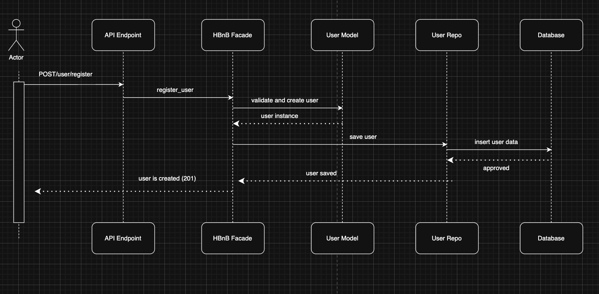

Here is a **clean, structured Markdown section** for your README exactly matching your assignment style 👇

---

## 2. Sequence Diagrams for API Calls

This section presents four sequence diagrams that illustrate how different layers of the HBnB application interact to process API requests.

Each diagram shows the communication flow between:

* **Presentation Layer (API)**
* **Business Logic Layer (Facade & Models)**
* **Persistence Layer (Repository & Database)**

## 2.1 User Registration

